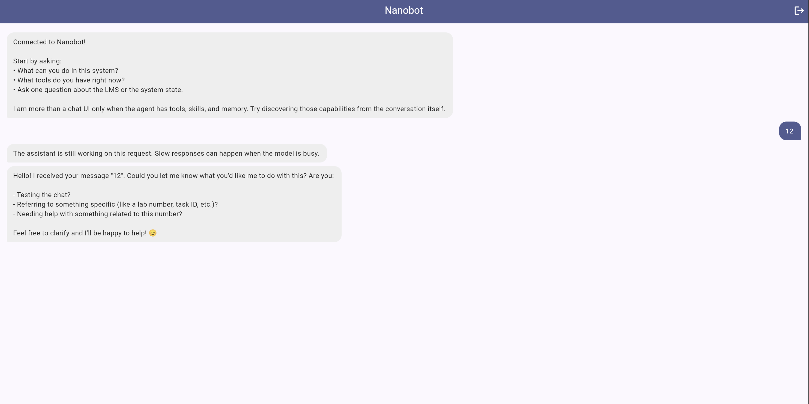
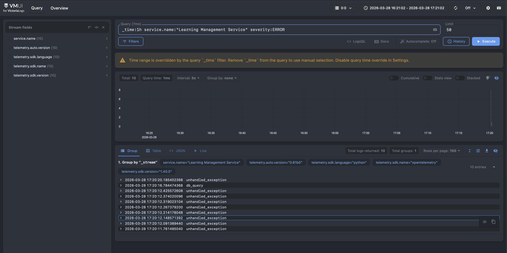

# Lab 8 — Report

Paste your checkpoint evidence below. Add screenshots as image files in the repo and reference them with ``.

## Task 1A — Bare agent

Using config: /root/se-toolkit-lab-8/nanobot/config.json
⠸ nanobot is thinking...2026-03-28 14:50:04.166 | DEBUG    | nanobot.agent.tools.mcp:connect_mcp_servers:226 - MCP: registered tool 'mcp_lms_lms_health' from server 'lms'
2026-03-28 14:50:04.166 | DEBUG    | nanobot.agent.tools.mcp:connect_mcp_servers:226 - MCP: registered tool 'mcp_lms_lms_labs' from server 'lms'
2026-03-28 14:50:04.167 | DEBUG    | nanobot.agent.tools.mcp:connect_mcp_servers:226 - MCP: registered tool 'mcp_lms_lms_learners' from server 'lms'
2026-03-28 14:50:04.167 | DEBUG    | nanobot.agent.tools.mcp:connect_mcp_servers:226 - MCP: registered tool 'mcp_lms_lms_pass_rates' from server 'lms'
2026-03-28 14:50:04.167 | DEBUG    | nanobot.agent.tools.mcp:connect_mcp_servers:226 - MCP: registered tool 'mcp_lms_lms_timeline' from server 'lms'
2026-03-28 14:50:04.168 | DEBUG    | nanobot.agent.tools.mcp:connect_mcp_servers:226 - MCP: registered tool 'mcp_lms_lms_groups' from server 'lms'
2026-03-28 14:50:04.168 | DEBUG    | nanobot.agent.tools.mcp:connect_mcp_servers:226 - MCP: registered tool 'mcp_lms_lms_top_learners' from server 'lms'
2026-03-28 14:50:04.168 | DEBUG    | nanobot.agent.tools.mcp:connect_mcp_servers:226 - MCP: registered tool 'mcp_lms_lms_completion_rate' from server 'lms'
2026-03-28 14:50:04.168 | DEBUG    | nanobot.agent.tools.mcp:connect_mcp_servers:226 - MCP: registered tool 'mcp_lms_lms_sync_pipeline' from server 'lms'
2026-03-28 14:50:04.169 | INFO     | nanobot.agent.tools.mcp:connect_mcp_servers:246 - MCP server 'lms': connected, 9 tools registered
2026-03-28 14:50:04.169 | INFO     | nanobot.agent.loop:_process_message:425 - Processing message from cli:user: What is the agentic loop?

🐈 nanobot
The agentic loop is the fundamental cycle that autonomous AI agents follow to accomplish tasks. It typically consists of these core stages:               

 1 Perceive — Gather information from the environment (user input, tool outputs, external data sources)                                                   
 2 Reason — Analyze the information, plan next steps, and make decisions about what actions to take                                                       
 3 Act — Execute actions using available tools (file operations, API calls, web searches, etc.)                                                           
 4 Observe — Receive feedback from the actions taken (success, failure, new data)                                                                         
 5 Iterate — Repeat the loop until the goal is achieved or a stopping condition is met                                                                    

                                                                                                                                                          
 ┌─────────────┐                                                                                                                                          
 │   Perceive  │                                                                                                                                          
 └──────┬──────┘                                                                                                                                          
        ↓                                                                                                                                                 
 ┌─────────────┐                                                                                                                                          
 │    Reason   │                                                                                                                                          
 └──────┬──────┘                                                                                                                                          
        ↓                                                                                                                                                 
 ┌─────────────┐                                                                                                                                          
 │     Act     │                                                                                                                                          
 └──────┬──────┘                                                                                                                                          
        ↓                                                                                                                                                 
 ┌─────────────┐                                                                                                                                          
 │   Observe   │                                                                                                                                          
 └──────┬──────┘                                                                                                                                          
        ↓                                                                                                                                                 
    (repeat)                                                                                                                                              
                                                                                                                                                          

This loop enables agents to:                                                                                                                              

 • Break complex tasks into manageable steps                                                                                                              
 • Adapt to new information dynamically                                                                                                                   
 • Recover from errors by trying alternative approaches                                                                                                   
 • Work autonomously toward a goal without constant human guidance                                                                                        

In my case, each time you give me a task, I go through this loop: I understand your request, decide which tools might help, execute them, evaluate the    
results, and continue until I can provide you with a complete answer.                                                                                     

2026-03-28 14:50:14.360 | INFO     | nanobot.agent.loop:_process_message:479 - Response to cli:user: The **agentic loop** is the fundamental cycle that autonomous AI agents follow to accomplish tasks. It typically consist...
2026-03-28 14:50:14.626 | DEBUG    | nanobot.agent.memory:maybe_consolidate_by_tokens:323 - Token consolidation idle cli:task1a-loop: 6067/65536 via tiktoken

Using config: /root/se-toolkit-lab-8/nanobot/config.json
⠸ nanobot is thinking...2026-03-28 14:50:30.545 | DEBUG    | nanobot.agent.tools.mcp:connect_mcp_servers:226 - MCP: registered tool 'mcp_lms_lms_health' from server 'lms'
2026-03-28 14:50:30.546 | DEBUG    | nanobot.agent.tools.mcp:connect_mcp_servers:226 - MCP: registered tool 'mcp_lms_lms_labs' from server 'lms'
2026-03-28 14:50:30.546 | DEBUG    | nanobot.agent.tools.mcp:connect_mcp_servers:226 - MCP: registered tool 'mcp_lms_lms_learners' from server 'lms'
2026-03-28 14:50:30.547 | DEBUG    | nanobot.agent.tools.mcp:connect_mcp_servers:226 - MCP: registered tool 'mcp_lms_lms_pass_rates' from server 'lms'
2026-03-28 14:50:30.547 | DEBUG    | nanobot.agent.tools.mcp:connect_mcp_servers:226 - MCP: registered tool 'mcp_lms_lms_timeline' from server 'lms'
2026-03-28 14:50:30.547 | DEBUG    | nanobot.agent.tools.mcp:connect_mcp_servers:226 - MCP: registered tool 'mcp_lms_lms_groups' from server 'lms'
2026-03-28 14:50:30.547 | DEBUG    | nanobot.agent.tools.mcp:connect_mcp_servers:226 - MCP: registered tool 'mcp_lms_lms_top_learners' from server 'lms'
2026-03-28 14:50:30.548 | DEBUG    | nanobot.agent.tools.mcp:connect_mcp_servers:226 - MCP: registered tool 'mcp_lms_lms_completion_rate' from server 'lms'
2026-03-28 14:50:30.548 | DEBUG    | nanobot.agent.tools.mcp:connect_mcp_servers:226 - MCP: registered tool 'mcp_lms_lms_sync_pipeline' from server 'lms'
2026-03-28 14:50:30.548 | INFO     | nanobot.agent.tools.mcp:connect_mcp_servers:246 - MCP server 'lms': connected, 9 tools registered
2026-03-28 14:50:30.548 | INFO     | nanobot.agent.loop:_process_message:425 - Processing message from cli:user: What labs are available in our LMS?
2026-03-28 14:50:33.304 | INFO     | nanobot.agent.loop:_prepare_tools:253 - Tool call: mcp_lms_lms_labs({})

🐈 nanobot
Here are the available labs in the LMS:                                                                                                                   

 1 Lab 01 – Products, Architecture & Roles                                                                                                                
 2 Lab 02 — Run, Fix, and Deploy a Backend Service                                                                                                        
 3 Lab 03 — Backend API: Explore, Debug, Implement, Deploy                                                                                                
 4 Lab 04 — Testing, Front-end, and AI Agents                                                                                                             
 5 Lab 05 — Data Pipeline and Analytics Dashboard                                                                                                         
 6 Lab 06 — Build Your Own Agent                                                                                                                          
 7 Lab 07 — Build a Client with an AI Coding Agent                                                                                                        
 8 lab-08                                                                                                                                                 

Let me know if you'd like to see details like pass rates, completion rates, or top learners for any specific lab!                                         

2026-03-28 14:50:37.155 | INFO     | nanobot.agent.loop:_process_message:479 - Response to cli:user: Here are the available labs in the LMS:

1. **Lab 01** – Products, Architecture & Roles
2. **Lab 02** — Run, Fix, and De...
2026-03-28 14:50:37.417 | DEBUG    | nanobot.agent.memory:maybe_consolidate_by_tokens:323 - Token consolidation idle cli:task1a-labs: 6259/65536 via tiktoken


## Task 1B — Agent with LMS tools

Using config: /root/se-toolkit-lab-8/nanobot/config.json
⠸ nanobot is thinking...2026-03-28 14:50:04.166 | DEBUG    | nanobot.agent.tools.mcp:connect_mcp_servers:226 - MCP: registered tool 'mcp_lms_lms_health' from server 'lms'
2026-03-28 14:50:04.166 | DEBUG    | nanobot.agent.tools.mcp:connect_mcp_servers:226 - MCP: registered tool 'mcp_lms_lms_labs' from server 'lms'
2026-03-28 14:50:04.167 | DEBUG    | nanobot.agent.tools.mcp:connect_mcp_servers:226 - MCP: registered tool 'mcp_lms_lms_learners' from server 'lms'
2026-03-28 14:50:04.167 | DEBUG    | nanobot.agent.tools.mcp:connect_mcp_servers:226 - MCP: registered tool 'mcp_lms_lms_pass_rates' from server 'lms'
2026-03-28 14:50:04.167 | DEBUG    | nanobot.agent.tools.mcp:connect_mcp_servers:226 - MCP: registered tool 'mcp_lms_lms_timeline' from server 'lms'
2026-03-28 14:50:04.168 | DEBUG    | nanobot.agent.tools.mcp:connect_mcp_servers:226 - MCP: registered tool 'mcp_lms_lms_groups' from server 'lms'
2026-03-28 14:50:04.168 | DEBUG    | nanobot.agent.tools.mcp:connect_mcp_servers:226 - MCP: registered tool 'mcp_lms_lms_top_learners' from server 'lms'
2026-03-28 14:50:04.168 | DEBUG    | nanobot.agent.tools.mcp:connect_mcp_servers:226 - MCP: registered tool 'mcp_lms_lms_completion_rate' from server 'lms'
2026-03-28 14:50:04.168 | DEBUG    | nanobot.agent.tools.mcp:connect_mcp_servers:226 - MCP: registered tool 'mcp_lms_lms_sync_pipeline' from server 'lms'
2026-03-28 14:50:04.169 | INFO     | nanobot.agent.tools.mcp:connect_mcp_servers:246 - MCP server 'lms': connected, 9 tools registered
2026-03-28 14:50:04.169 | INFO     | nanobot.agent.loop:_process_message:425 - Processing message from cli:user: What is the agentic loop?

🐈 nanobot
The agentic loop is the fundamental cycle that autonomous AI agents follow to accomplish tasks. It typically consists of these core stages:               

 1 Perceive — Gather information from the environment (user input, tool outputs, external data sources)                                                   
 2 Reason — Analyze the information, plan next steps, and make decisions about what actions to take                                                       
 3 Act — Execute actions using available tools (file operations, API calls, web searches, etc.)                                                           
 4 Observe — Receive feedback from the actions taken (success, failure, new data)                                                                         
 5 Iterate — Repeat the loop until the goal is achieved or a stopping condition is met                                                                    

                                                                                                                                                          
 ┌─────────────┐                                                                                                                                          
 │   Perceive  │                                                                                                                                          
 └──────┬──────┘                                                                                                                                          
        ↓                                                                                                                                                 
 ┌─────────────┐                                                                                                                                          
 │    Reason   │                                                                                                                                          
 └──────┬──────┘                                                                                                                                          
        ↓                                                                                                                                                 
 ┌─────────────┐                                                                                                                                          
 │     Act     │                                                                                                                                          
 └──────┬──────┘                                                                                                                                          
        ↓                                                                                                                                                 
 ┌─────────────┐                                                                                                                                          
 │   Observe   │                                                                                                                                          
 └──────┬──────┘                                                                                                                                          
        ↓                                                                                                                                                 
    (repeat)                                                                                                                                              
                                                                                                                                                          

This loop enables agents to:                                                                                                                              

 • Break complex tasks into manageable steps                                                                                                              
 • Adapt to new information dynamically                                                                                                                   
 • Recover from errors by trying alternative approaches                                                                                                   
 • Work autonomously toward a goal without constant human guidance                                                                                        

In my case, each time you give me a task, I go through this loop: I understand your request, decide which tools might help, execute them, evaluate the    
results, and continue until I can provide you with a complete answer.                                                                                     

2026-03-28 14:50:14.360 | INFO     | nanobot.agent.loop:_process_message:479 - Response to cli:user: The **agentic loop** is the fundamental cycle that autonomous AI agents follow to accomplish tasks. It typically consist...
2026-03-28 14:50:14.626 | DEBUG    | nanobot.agent.memory:maybe_consolidate_by_tokens:323 - Token consolidation idle cli:task1a-loop: 6067/65536 via tiktoken

Using config: /root/se-toolkit-lab-8/nanobot/config.json
⠸ nanobot is thinking...2026-03-28 14:50:30.545 | DEBUG    | nanobot.agent.tools.mcp:connect_mcp_servers:226 - MCP: registered tool 'mcp_lms_lms_health' from server 'lms'
2026-03-28 14:50:30.546 | DEBUG    | nanobot.agent.tools.mcp:connect_mcp_servers:226 - MCP: registered tool 'mcp_lms_lms_labs' from server 'lms'
2026-03-28 14:50:30.546 | DEBUG    | nanobot.agent.tools.mcp:connect_mcp_servers:226 - MCP: registered tool 'mcp_lms_lms_learners' from server 'lms'
2026-03-28 14:50:30.547 | DEBUG    | nanobot.agent.tools.mcp:connect_mcp_servers:226 - MCP: registered tool 'mcp_lms_lms_pass_rates' from server 'lms'
2026-03-28 14:50:30.547 | DEBUG    | nanobot.agent.tools.mcp:connect_mcp_servers:226 - MCP: registered tool 'mcp_lms_lms_timeline' from server 'lms'
2026-03-28 14:50:30.547 | DEBUG    | nanobot.agent.tools.mcp:connect_mcp_servers:226 - MCP: registered tool 'mcp_lms_lms_groups' from server 'lms'
2026-03-28 14:50:30.547 | DEBUG    | nanobot.agent.tools.mcp:connect_mcp_servers:226 - MCP: registered tool 'mcp_lms_lms_top_learners' from server 'lms'
2026-03-28 14:50:30.548 | DEBUG    | nanobot.agent.tools.mcp:connect_mcp_servers:226 - MCP: registered tool 'mcp_lms_lms_completion_rate' from server 'lms'
2026-03-28 14:50:30.548 | DEBUG    | nanobot.agent.tools.mcp:connect_mcp_servers:226 - MCP: registered tool 'mcp_lms_lms_sync_pipeline' from server 'lms'
2026-03-28 14:50:30.548 | INFO     | nanobot.agent.tools.mcp:connect_mcp_servers:246 - MCP server 'lms': connected, 9 tools registered
2026-03-28 14:50:30.548 | INFO     | nanobot.agent.loop:_process_message:425 - Processing message from cli:user: What labs are available in our LMS?
2026-03-28 14:50:33.304 | INFO     | nanobot.agent.loop:_prepare_tools:253 - Tool call: mcp_lms_lms_labs({})

🐈 nanobot
Here are the available labs in the LMS:                                                                                                                   

 1 Lab 01 – Products, Architecture & Roles                                                                                                                
 2 Lab 02 — Run, Fix, and Deploy a Backend Service                                                                                                        
 3 Lab 03 — Backend API: Explore, Debug, Implement, Deploy                                                                                                
 4 Lab 04 — Testing, Front-end, and AI Agents                                                                                                             
 5 Lab 05 — Data Pipeline and Analytics Dashboard                                                                                                         
 6 Lab 06 — Build Your Own Agent                                                                                                                          
 7 Lab 07 — Build a Client with an AI Coding Agent                                                                                                        
 8 lab-08                                                                                                                                                 

Let me know if you'd like to see details like pass rates, completion rates, or top learners for any specific lab!                                         

2026-03-28 14:50:37.155 | INFO     | nanobot.agent.loop:_process_message:479 - Response to cli:user: Here are the available labs in the LMS:

1. **Lab 01** – Products, Architecture & Roles
2. **Lab 02** — Run, Fix, and De...
2026-03-28 14:50:37.417 | DEBUG    | nanobot.agent.memory:maybe_consolidate_by_tokens:323 - Token consolidation idle cli:task1a-labs: 6259/65536 via tiktoken

## Task 1C — Skill prompt

Using config: /root/se-toolkit-lab-8/nanobot/config.json
⠼ nanobot is thinking...2026-03-28 14:44:20.691 | DEBUG    | nanobot.agent.tools.mcp:connect_mcp_servers:226 - MCP: registered tool 'mcp_lms_lms_health' from server 'lms'
2026-03-28 14:44:20.692 | DEBUG    | nanobot.agent.tools.mcp:connect_mcp_servers:226 - MCP: registered tool 'mcp_lms_lms_labs' from server 'lms'
2026-03-28 14:44:20.692 | DEBUG    | nanobot.agent.tools.mcp:connect_mcp_servers:226 - MCP: registered tool 'mcp_lms_lms_learners' from server 'lms'
2026-03-28 14:44:20.692 | DEBUG    | nanobot.agent.tools.mcp:connect_mcp_servers:226 - MCP: registered tool 'mcp_lms_lms_pass_rates' from server 'lms'
2026-03-28 14:44:20.692 | DEBUG    | nanobot.agent.tools.mcp:connect_mcp_servers:226 - MCP: registered tool 'mcp_lms_lms_timeline' from server 'lms'
2026-03-28 14:44:20.692 | DEBUG    | nanobot.agent.tools.mcp:connect_mcp_servers:226 - MCP: registered tool 'mcp_lms_lms_groups' from server 'lms'
2026-03-28 14:44:20.693 | DEBUG    | nanobot.agent.tools.mcp:connect_mcp_servers:226 - MCP: registered tool 'mcp_lms_lms_top_learners' from server 'lms'
2026-03-28 14:44:20.693 | DEBUG    | nanobot.agent.tools.mcp:connect_mcp_servers:226 - MCP: registered tool 'mcp_lms_lms_completion_rate' from server 'lms'
2026-03-28 14:44:20.693 | DEBUG    | nanobot.agent.tools.mcp:connect_mcp_servers:226 - MCP: registered tool 'mcp_lms_lms_sync_pipeline' from server 'lms'
2026-03-28 14:44:20.693 | INFO     | nanobot.agent.tools.mcp:connect_mcp_servers:246 - MCP server 'lms': connected, 9 tools registered
2026-03-28 14:44:20.693 | INFO     | nanobot.agent.loop:_process_message:425 - Processing message from cli:user: Show me the scores

🐈 nanobot
I'll help you view the scores. First, let me check what labs are available in the LMS.                                                                    
2026-03-28 14:44:25.318 | INFO     | nanobot.agent.loop:_prepare_tools:253 - Tool call: mcp_lms_lms_labs({})

🐈 nanobot
There are 8 labs available. Which lab would you like to see the scores for?                                                                               

 1 Lab 01 – Products, Architecture & Roles                                                                                                                
 2 Lab 02 — Run, Fix, and Deploy a Backend Service                                                                                                        
 3 Lab 03 — Backend API: Explore, Debug, Implement, Deploy                                                                                                
 4 Lab 04 — Testing, Front-end, and AI Agents                                                                                                             
 5 Lab 05 — Data Pipeline and Analytics Dashboard                                                                                                         
 6 Lab 06 — Build Your Own Agent                                                                                                                          
 7 Lab 07 — Build a Client with an AI Coding Agent                                                                                                        
 8 lab-08                                                                                                                                                 

Please let me know which lab you'd like to see, or if you'd like to see scores for all labs.                                                              

2026-03-28 14:44:29.221 | INFO     | nanobot.agent.loop:_process_message:479 - Response to cli:user: There are 8 labs available. Which lab would you like to see the scores for?

1. Lab 01 – Products, Architecture & Roles
...
2026-03-28 14:44:29.706 | DEBUG    | nanobot.agent.memory:maybe_consolidate_by_tokens:323 - Token consolidation idle cli:task1c: 6269/65536 via tiktoken

## Task 2A — Deployed agent

nanobot-1  | Using config: /tmp/config.resolved.json
nanobot-1  | 🐈 Starting nanobot gateway version 0.1.4.post5 on port 18790...
nanobot-1  | 2026-03-28 12:49:11.911 | DEBUG    | nanobot.channels.registry:discover_all:64 - Skipping built-in channel 'matrix': Matrix dependencies not installed. Run: pip install nanobot-ai[matrix]
nanobot-1  | Warning: No channels enabled
nanobot-1  | ✓ Heartbeat: every 1800s
nanobot-1  | 
nanobot-1  | Error: Gateway crashed unexpectedly
nanobot-1  | Traceback (most recent call last):
nanobot-1  |   File "/app/.venv/lib/python3.14/site-packages/nanobot/cli/commands.py", line 
nanobot-1  | 679, in run
nanobot-1  |     await cron.start()
nanobot-1  |   File "/app/.venv/lib/python3.14/site-packages/nanobot/cron/service.py", line 
nanobot-1  | 200, in start
nanobot-1  |     self._save_store()
nanobot-1  |     ~~~~~~~~~~~~~~~~^^
nanobot-1  |   File "/app/.venv/lib/python3.14/site-packages/nanobot/cron/service.py", line 
nanobot-1  | 146, in _save_store
nanobot-1  |     self.store_path.parent.mkdir(parents=True, exist_ok=True)
nanobot-1  |     ~~~~~~~~~~~~~~~~~~~~~~~~~~~~^^^^^^^^^^^^^^^^^^^^^^^^^^^^^
nanobot-1  |   File "/usr/local/lib/python3.14/pathlib/__init__.py", line 1011, in mkdir
nanobot-1  |     os.mkdir(self, mode)
nanobot-1  |     ~~~~~~~~^^^^^^^^^^^^
nanobot-1  | PermissionError: [Errno 13] Permission denied: '/app/nanobot/workspace/cron'
nanobot-1  | 
nanobot-1  | 2026-03-28 12:49:12.441 | INFO     | nanobot.agent.loop:stop:387 - Agent loop stopping
nanobot-1  | 2026-03-28 12:49:12.441 | INFO     | nanobot.channels.manager:stop_all:99 - Stopping all channels...
nanobot-1  | Loading config from: /app/nanobot/config.json
nanobot-1  | Writing resolved config to: /tmp/config.resolved.json
nanobot-1  | Resolved LLM API base: http://qwen-code-api:8080/v1
nanobot-1  | Resolved model: coder-model
nanobot-1  | Resolved gateway: 0.0.0.0:18790
nanobot-1  | Using config: /tmp/config.resolved.json
nanobot-1  | 🐈 Starting nanobot gateway version 0.1.4.post5 on port 18790...
nanobot-1  | 2026-03-28 12:50:06.595 | DEBUG    | nanobot.channels.registry:discover_all:64 - Skipping built-in channel 'matrix': Matrix dependencies not installed. Run: pip install nanobot-ai[matrix]
nanobot-1  | Warning: No channels enabled
nanobot-1  | ✓ Heartbeat: every 1800s
nanobot-1  | 2026-03-28 12:50:07.071 | INFO     | nanobot.cron.service:start:202 - Cron service started with 0 jobs
nanobot-1  | 2026-03-28 12:50:07.071 | INFO     | nanobot.heartbeat.service:start:124 - Heartbeat started (every 1800s)
nanobot-1  | 2026-03-28 12:50:07.706 | WARNING  | nanobot.channels.manager:start_all:82 - No channels enabled
nanobot-1  | 2026-03-28 12:50:09.917 | DEBUG    | nanobot.agent.tools.mcp:connect_mcp_servers:226 - MCP: registered tool 'mcp_lms_lms_health' from server 'lms'
nanobot-1  | 2026-03-28 12:50:09.918 | DEBUG    | nanobot.agent.tools.mcp:connect_mcp_servers:226 - MCP: registered tool 'mcp_lms_lms_labs' from server 'lms'
nanobot-1  | 2026-03-28 12:50:09.918 | DEBUG    | nanobot.agent.tools.mcp:connect_mcp_servers:226 - MCP: registered tool 'mcp_lms_lms_learners' from server 'lms'
nanobot-1  | 2026-03-28 12:50:09.918 | DEBUG    | nanobot.agent.tools.mcp:connect_mcp_servers:226 - MCP: registered tool 'mcp_lms_lms_pass_rates' from server 'lms'
nanobot-1  | 2026-03-28 12:50:09.918 | DEBUG    | nanobot.agent.tools.mcp:connect_mcp_servers:226 - MCP: registered tool 'mcp_lms_lms_timeline' from server 'lms'
nanobot-1  | 2026-03-28 12:50:09.919 | DEBUG    | nanobot.agent.tools.mcp:connect_mcp_servers:226 - MCP: registered tool 'mcp_lms_lms_groups' from server 'lms'
nanobot-1  | 2026-03-28 12:50:09.919 | DEBUG    | nanobot.agent.tools.mcp:connect_mcp_servers:226 - MCP: registered tool 'mcp_lms_lms_top_learners' from server 'lms'
nanobot-1  | 2026-03-28 12:50:09.919 | DEBUG    | nanobot.agent.tools.mcp:connect_mcp_servers:226 - MCP: registered tool 'mcp_lms_lms_completion_rate' from server 'lms'
nanobot-1  | 2026-03-28 12:50:09.919 | DEBUG    | nanobot.agent.tools.mcp:connect_mcp_servers:226 - MCP: registered tool 'mcp_lms_lms_sync_pipeline' from server 'lms'
nanobot-1  | 2026-03-28 12:50:09.919 | INFO     | nanobot.agent.tools.mcp:connect_mcp_servers:246 - MCP server 'lms': connected, 9 tools registered
nanobot-1  | 2026-03-28 12:50:09.920 | INFO     | nanobot.agent.loop:run:280 - Agent loop started

## Task 2B — Web client



## Task 3A — Structured logging

### Happy path — GET /items/ (status 200)

Query: `_time:5m service.name:"Learning Management Service" severity:INFO`

```json
{"_msg":"request_started","event":"request_started","method":"GET","path":"/items/","service.name":"Learning Management Service","severity":"INFO","trace_id":"74f41c0bdd51a7c98455b05b1ff6b4ff"}
{"_msg":"auth_success","event":"auth_success","service.name":"Learning Management Service","severity":"INFO","trace_id":"74f41c0bdd51a7c98455b05b1ff6b4ff"}
{"_msg":"db_query","event":"db_query","operation":"select","table":"item","service.name":"Learning Management Service","severity":"INFO","trace_id":"74f41c0bdd51a7c98455b05b1ff6b4ff"}
{"_msg":"request_completed","event":"request_completed","method":"GET","path":"/items/","status":"200","duration_ms":"861","service.name":"Learning Management Service","severity":"INFO","trace_id":"74f41c0bdd51a7c98455b05b1ff6b4ff"}
```

Flow: `request_started` → `auth_success` → `db_query` → `request_completed` (200 OK, 861ms)

### Error path — PostgreSQL stopped (status 404)

After `docker compose stop postgres`, a request to `/items/` produces:

```json
{"_msg":"db_query","event":"db_query","operation":"select","table":"item","severity":"ERROR","trace_id":"a2c779cb61e8445a79204cd32ce16432",
 "error":"(sqlalchemy.dialects.postgresql.asyncpg.InterfaceError) connection is closed\n[SQL: SELECT item.id, item.type, ... FROM item]"}
```

Flow: `request_started` → `auth_success` → `db_query` (**ERROR**: connection is closed) → `request_completed` (404)

### VictoriaLogs UI query

Queried `_time:10m service.name:"Learning Management Service" severity:ERROR` in VictoriaLogs UI at `http://<vm-ip>:42002/utils/victorialogs/select/vmui`. The UI shows structured JSON log entries with consistent fields (`service.name`, `severity`, `event`, `trace_id`), making it much easier to filter compared to grepping `docker compose logs`.



---

## Task 3B — Traces

### Healthy trace (trace_id: `74f41c0bdd51a7c98455b05b1ff6b4ff`)

```
Trace ID: 74f41c0bdd51a7c98455b05b1ff6b4ff
Total spans: 10
  span: SELECT db-lab-8        | duration: 307931µs (308ms)  | parent: a31dfb6ae0e6a3ba
  span: GET /items/ http send  | duration: 67µs              | parent: a31dfb6ae0e6a3ba
  span: GET /items/ http send  | duration: 23µs              | parent: a31dfb6ae0e6a3ba
  span: GET /items/ http send  | duration: 18µs              | parent: a31dfb6ae0e6a3ba
  span: connect                | duration: 530085µs (530ms)  | parent: (root)
  span: GET /items/            | duration: 904041µs (904ms)  | parent: (root)
  span: BEGIN;                 | duration: 68973µs (69ms)    | parent: (root)
  span: BEGIN;                 | duration: 319µs             | parent: (root)
  span: ROLLBACK;              | duration: 1846µs            | parent: (root)
  span: ROLLBACK;              | duration: 437µs             | parent: (root)
```

The trace shows the full request lifecycle:
- **Root span** `GET /items/` took 904ms total
- **Database connection** took 530ms (the `connect` span)
- **SQL SELECT** took 308ms
- Transaction was committed and rolled back cleanly

### Error trace (trace_id: `a2c779cb61e8445a79204cd32ce16432`)

```
Trace ID: a2c779cb61e8445a79204cd32ce16432
Total spans: 6
  span: SELECT db-lab-8        | duration: 9971µs (10ms)   | error: true
  span: GET /items/ http send  | duration: 69µs            | error: 
  span: GET /items/ http send  | duration: 39µs            | error: 
  span: GET /items/ http send  | duration: 31µs            | error: 
  span: connect                | duration: 171µs           | error: 
  span: GET /items/            | duration: 16943µs (17ms)  | error: 
```

Key differences from healthy trace:
- **SELECT span has `error: true`** — this is where the failure occurred
- **Total duration is only 17ms** (vs 904ms healthy) — the connection failed fast
- **No BEGIN/ROLLBACK spans** — the transaction never started because the connection was closed
- The error propagates from the SELECT span up through the root span

### VictoriaTraces UI screenshots

Healthy trace showing full span hierarchy:


Error trace showing `SELECT db-lab-8` with `error: true` tag:


---

## Task 3C — Observability MCP tools

### MCP Tools Registered (from nanobot logs):

```
2026-04-03 09:16:21 | MCP: registered tool 'mcp_obs_obs_logs_search' from server 'obs'
2026-04-03 09:16:21 | MCP: registered tool 'mcp_obs_obs_logs_error_count' from server 'obs'
2026-04-03 09:16:21 | MCP: registered tool 'mcp_obs_obs_traces_list' from server 'obs'
2026-04-03 09:16:21 | MCP: registered tool 'mcp_obs_obs_traces_get' from server 'obs'
2026-04-03 09:16:21 | INFO | MCP server 'obs': connected, 4 tools registered
```

### Agent Response 1 — Normal conditions (PostgreSQL running)

**Question:** "Any errors in the last hour? Check the logs."

**Agent reasoning and tool calls:**
```
[TOOL: mcp_obs_obs_logs_error_count] args: {"time_range": "1h"}
[TOOL_RESULT] "Found 0 error(s) across all services in the last 1h."
```

**Agent response:**
> Good news — no errors found across all services in the last hour. Everything looks clean! 🟢

*(Session: `webchat_8ea18bc3-8d52-4af3-afcd-2da308c4bb4c.jsonl`)*

---

### Agent Response 2 — Error conditions (PostgreSQL stopped)

**Setup:** `docker compose stop postgres` → triggered error request → asked same question.

**Agent reasoning and tool calls:**
```
[TOOL: mcp_obs_obs_logs_error_count] args: {"time_range": "1h"}
[TOOL_RESULT] "Found 1 error(s) across all services in the last 1h."

[TOOL: mcp_obs_obs_logs_search] args: {"query": "_time:1h severity:ERROR", "limit": 10}
[TOOL_RESULT] 1 log entry: db_query with "connection is closed" from Learning Management Service

Final agent response:
```

**Agent response:**
> Found **1 error** in the last hour:
>
> | Field | Value |
> |-------|-------|
> | **Time** | 2026-04-03 09:30:28 UTC (~8 min ago) |
> | **Service** | Learning Management Service |
> | **Event** | `db_query` (SELECT on `item` table) |
> | **Error** | `asyncpg.exceptions.InterfaceError: connection is closed` |
>
> **What happened:** A database query failed because the PostgreSQL connection was already closed. This is likely a transient connection pool issue — the LMS tried to run a `SELECT` on the `item` table but the underlying asyncpg connection had been dropped.
>
> Want me to fetch the full trace (`a2c779cb61e8445a79204cd32ce16432`) to see the broader request context, or check if the LMS is currently healthy?

*(Session: `webchat_684b9552-80bf-4a7b-9b8b-5ebd16e97069.jsonl`)*

### Agent reasoning flow

The agent followed the exact pattern taught by the observability skill:
1. Started with `obs_logs_error_count` for a quick error check
2. Found 1 error, used `obs_logs_search` to inspect details
3. Summarized findings concisely with structured table (not raw JSON)
4. Offered to fetch the full trace using the extracted `trace_id`

### Observability Skill

Created `nanobot/workspace/skills/observability/SKILL.md` teaching the agent:
1. Start with `obs_logs_error_count` for quick error check
2. Use `obs_logs_search` with LogsQL to dig into errors
3. Extract `trace_id` from log entries and use `obs_traces_get` for full trace
4. Summarize findings concisely — no raw JSON dumps

### Files Created:
- `mcp/mcp-obs/pyproject.toml` — Package definition
- `mcp/mcp-obs/src/mcp_obs/settings.py` — Environment config
- `mcp/mcp-obs/src/mcp_obs/observability.py` — VictoriaLogs + VictoriaTraces HTTP clients
- `mcp/mcp-obs/src/mcp_obs/tools.py` — 4 tool definitions with handlers
- `mcp/mcp-obs/src/mcp_obs/server.py` — MCP stdio server
- `nanobot/workspace/skills/observability/SKILL.md` — Skill prompt

## Task 4A — Multi-step investigation

<!-- Paste the agent's response to "What went wrong?" showing chained log + trace investigation -->

## Task 4B — Proactive health check

<!-- Screenshot or transcript of the proactive health report that appears in the Flutter chat -->

## Task 4C — Bug fix and recovery

<!-- 1. Root cause identified
     2. Code fix (diff or description)
     3. Post-fix response to "What went wrong?" showing the real underlying failure
     4. Healthy follow-up report or transcript after recovery -->
